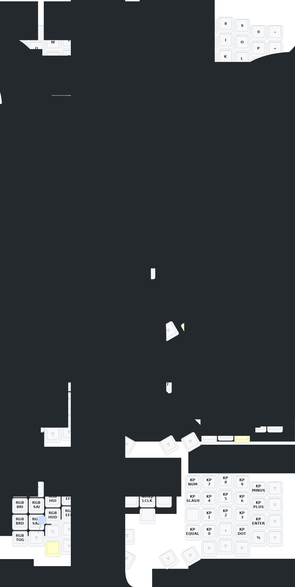

# Eyelash Sofle — ZMK Firmware

> [!WARNING]
> **Personal configuration — use at your own risk.**
> Releases are experimental and built for one specific keyboard. Key layout, timing, and layer assignments are tuned to personal preference and may change without notice. If you have the same hardware, feel free to use this as a starting point, but do not expect a stable or general-purpose firmware.

> Original hardware by [380465425@qq.com](mailto:380465425@qq.com) · Original README (Chinese): [README_JP.md](README_JP.md)

ZMK firmware configuration for the **Eyelash Sofle** split keyboard (NRF52840, nice!nano v2, nice!view display). Features home row mods, a full 5-layer layout, and ZMK Studio support on the left half.

## Keymap



See [KEYMAP.md](KEYMAP.md) for the full layer reference and hold-tap timing documentation.

See [WM_KEYBINDS.md](WM_KEYBINDS.md) for suggested window manager keybind configuration (niri, GNOME, COSMIC) to match the NAV layer workspace and monitor navigation keys.

---

## Layers

| # | Name | Access |
|---|------|--------|
| 0 | BASE | always on |
| 1 | NAV | hold `mo1` — left thumb |
| 2 | CODE | hold `lt(2,DEL)` — right thumb |
| 3 | MEDIA | hold `mo3` — right thumb |
| 4 | SYS\|NUM | hold `mo4` — left thumb |

### BASE

QWERTY with home row mods and AltGr mod-tap:

| Key | Tap | Hold |
|-----|-----|------|
| D | D | LCTRL |
| F | F | LSHFT |
| G | G | LALT |
| H | H | LALT |
| J | J | RSHFT |
| K | K | RCTRL |
| T | T | RALT (AltGr) |
| Y | Y | RALT (AltGr) |

**Left thumb:** `mo(SYS|NUM)` · `F11` · `LGUI` · `mo(NAV)` · `BSPC`

**Right thumb:** `SPACE` · `lt(CODE,DEL)` · `mo(MEDIA)` · `F12` · `CapsWord`

Hold-tap timing: `tapping-term=280ms` · `require-prior-idle=150ms` · `quick-tap=175ms` · `flavor=balanced`

### NAV (1)

- **Top row:** F12 · F1–F11
- **Row 2:** mouse buttons (L/M/R/4/5) · Home · PgDn · PgUp · End · Ins · Print
- **Home row:** WM monitor/workspace navigation (Super+key combos) · Left · Down · Up · Right · Del
- **Bottom row:** WM move-to-workspace/monitor combos · workspace shortcuts (N=ws1, M=next, ,=prev, .=last, /=mon-left, RET=mon-right)
- **Encoder D-pad:** mouse pointer movement
- **Thumb:** Del · App menu · LCTRL · Left · Right

### CODE (2)

Left home + bottom rows, right side transparent.

**Home row:** `` ` `` · `{` · `}` · `[`(LCTRL) · `]`(LSHFT) · `+`(LALT)

**Bottom row:** `-` · `_` · `(` · `)` · `=`

### MEDIA (3)

**Home row:** Vol↓ · Vol↑ · Play/Pause · Stop

**Bottom row:** F20 (mic mute) · Mute · Prev · Next

**Encoder D-pad:** Vol↑/↓ (vertical) · Play/Pause (left) · Next (right) · Mute (center)

### SYS|NUM (4)

**Left — Bluetooth:** CLR · BT0–BT4

**Left — RGB:** Brightness · Saturation · Hue · Effect (increase row 1 / decrease row 2) · RGB Toggle

**Right — Numpad** (aligned with base layer 7/8/9):

```
NUM  7   8   9   -
 /   4   5   6   +
 *   1   2   3  Ent
 =   0   ,   .   %
```

**Encoder D-pad:** mouse pointer movement · center = left click

---

## Flashing

### Quick flash — recommended

One command downloads the latest firmware from GitHub Actions and walks you through flashing both halves:

```bash
mise run flash-release
```

Follow the on-screen prompts: double-tap reset on the left half when asked, then on the right half. The task handles everything else (artifact download, mount detection, `sync`, unmount wait).

Requires `mise` and `gh` (GitHub CLI, authenticated). If you don't have them, see [FLASHING_MANUAL.md](FLASHING_MANUAL.md) for the drag-and-drop flow.

### Clearing ZMK Studio overlay (when new firmware doesn't take effect)

If you've used ZMK Studio to edit the keymap live, the changes are stored on the left half's settings partition and **survive a normal firmware flash**. Symptom: you flash a new release and the keymap still behaves like the old version.

Fix — flash settings reset first, then the normal firmware on top:

```bash
mise run flash-release-reset   # double-tap the LEFT half when prompted
mise run flash-release          # double-tap left, then right
```

This also wipes the left half's Bluetooth bonds — see [Re-pairing the halves](#re-pairing-the-halves) below if the halves don't auto-pair afterwards.

### Firmware files

For reference — the `mise` task downloads these automatically, but if you're flashing manually they are:

| File | Target |
|------|--------|
| `eyelash_sofle_studio_left.uf2` | Left half (ZMK Studio enabled) |
| `nice_view-eyelash_sofle_right-zmk.uf2` | Right half |
| `settings_reset-nice_nano_v2-zmk.uf2` | Either half — clears Studio overlay + BT bonds |

For the drag-and-drop flashing flow without `mise`, see [FLASHING_MANUAL.md](FLASHING_MANUAL.md).

### Re-pairing the halves

If the halves fail to connect to each other, clear their Bluetooth bonds and let them re-discover:

**Left half — via the keymap (no reflash needed):**
1. Hold `mo(SYS|NUM)` (left thumb) and tap `BT_CLR` (top-left of the SYS layer, above `Q`).

**Right half — always requires settings reset:**
1. Flash `settings_reset-nice_nano_v2-zmk.uf2` to the right half (the right half has no independent access to the SYS layer when disconnected).

**After clearing bonds:**
1. Power off both halves.
2. Power on the **right** half first (peripheral — starts advertising).
3. Power on the **left** half (central — scans and connects).
4. They auto-pair within a few seconds.

---

## Building Locally on Arch Linux

This repo uses [ZMK Firmware](https://zmk.dev/) with a west workspace and [mise](https://mise.jdx.dev/) for environment management.

### 1. Install system dependencies

```bash
sudo pacman -S cmake ninja dtc git dfu-util
yay -S python-west mise
```

> **Why not `yay -S zephyr-sdk`?** The AUR package installs SDK 1.0.0 (March 2026), which requires Zephyr 4.2+. ZMK v0.3.0 targets Zephyr 3.5 — incompatible.

### 2. Install the Zephyr SDK 0.17.0 (ARM toolchain)

The SDK goes into `tools/` (already gitignored):

```bash
mkdir -p tools
wget -P tools https://github.com/zephyrproject-rtos/sdk-ng/releases/download/v0.17.0/zephyr-sdk-0.17.0_linux-x86_64_minimal.tar.xz
tar xf tools/zephyr-sdk-0.17.0_linux-x86_64_minimal.tar.xz -C tools/
tools/zephyr-sdk-0.17.0/setup.sh -t arm-zephyr-eabi -h -c
rm tools/zephyr-sdk-0.17.0_linux-x86_64_minimal.tar.xz
```

### 3. Bootstrap the environment (run once)

mise provisions Python 3.12 via uv and auto-activates a `.venv` on `cd`:

```bash
mise install
mise run setup
```

`setup` runs `west init`, `west update`, `west zephyr-export`, and installs Python deps into the venv. ZMK source lands in `zmk/` and `modules/` (gitignored).

### 4. Build and flash

Build the firmware locally:

```bash
mise run build-left    # left half (ZMK Studio enabled)
mise run build-right   # right half
mise run build-reset   # settings reset (clears Studio overlay + BT bonds)
```

Flash the locally-built firmware:

```bash
mise run flash-left    # or flash-right / flash-reset
```

Each `flash-*` task prompts you to double-tap reset, waits up to 60 seconds for the `NICENANO` drive to mount, copies the `.uf2`, and syncs the write. The keyboard reboots automatically once the copy completes.

> If you just want to flash a release without building from source, use `mise run flash-release` instead — it downloads the latest main artifacts from GitHub Actions. See the [Flashing](#flashing) section above.

### 5. Keymap Editor (visual web editor + auto-build)

[keymap-editor](https://nickcoutsos.github.io/keymap-editor/) is a browser-based visual keymap editor that commits changes directly to this repo and triggers a firmware build automatically.

**Setup (one-time):**
1. Install the [keymap-editor GitHub App](https://github.com/apps/keymap-editor) and grant it access to this repo.
2. Open [nickcoutsos.github.io/keymap-editor](https://nickcoutsos.github.io/keymap-editor/) and sign in with GitHub.
3. Select this repo — it will detect `config/eyelash_sofle.keymap` and `config/eyelash_sofle.json` automatically.

**Workflow:**
1. Edit keybindings visually in the browser.
2. Click **Save** — keymap-editor commits the updated `.keymap` to `main`.
3. GitHub Actions runs automatically:
   - `build.yml` builds new firmware and uploads `.uf2` artifacts.
   - `draw.yml` regenerates the keymap SVG in `keymap-drawer/`.
4. Download the artifacts from the [Actions tab](../../actions) and flash.

> The `build.yml` and `draw.yml` workflows trigger on `main` pushes only. Use `workflow_dispatch` from the Actions tab to build manually from any branch.

### 6. ZMK Studio (live keymap editing)

With the Studio firmware on the left half, you can edit keymaps live without rebuilding:

1. Connect the left half via USB.
2. Open [studio.zmk.dev](https://studio.zmk.dev) in Chrome/Edge (WebSerial required).
3. Changes apply immediately; click **Save** to persist to flash.

> Rebuilding and reflashing will overwrite Studio changes — export your keymap first if needed.
